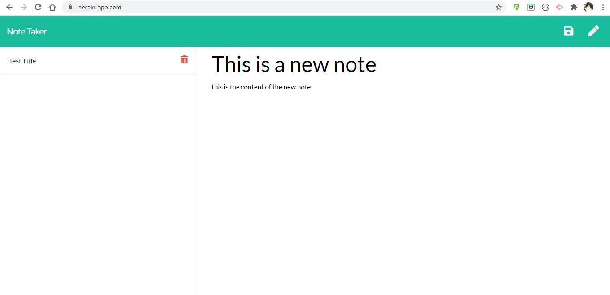
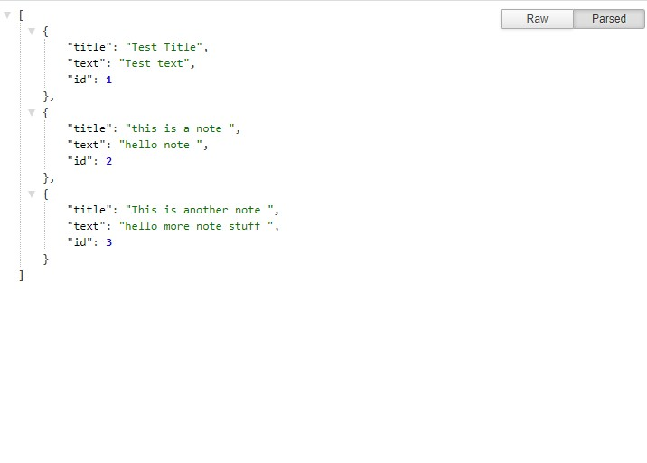
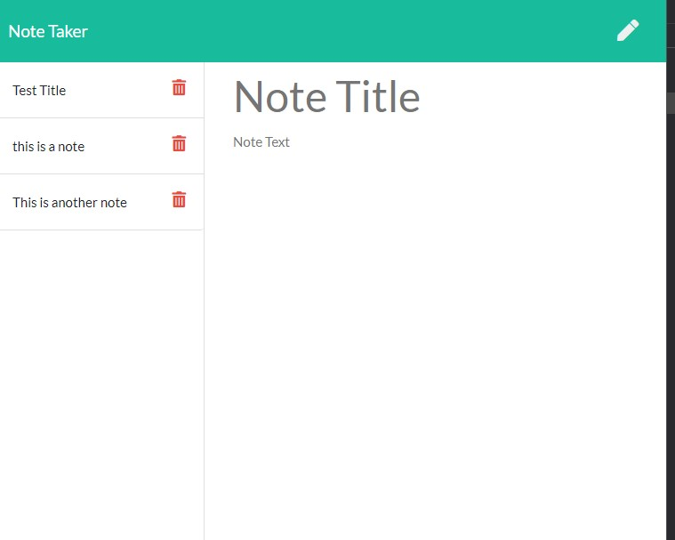
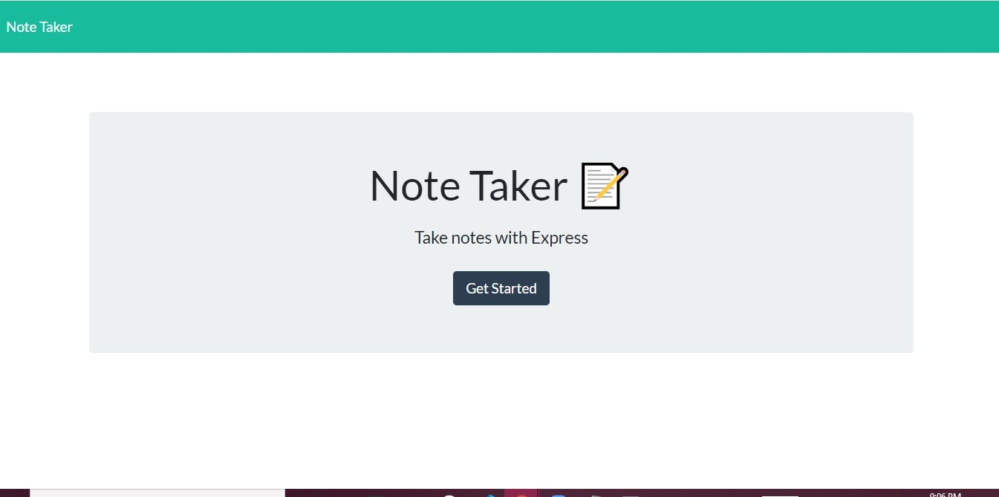

# NoteTaker


  ## Description
   App using Express.js to save and delete notes! 
   
   ```
AS A user, I want to be able to write and save notes
I WANT to be able to delete notes I've written before
SO THAT I can organize my thoughts and keep track of tasks I need to complete
```


  ## 🔎 Table of Contents
  - [Description](#Description)
  - [Installation](#Installation)
  - [Features](#Features)
  - [Screenshots](#Screenshots)
  - [Links](#Links)
  - [Contributing](#Contributing)
  - [Credits](#Credits)
  - [License](#License)
  - [Questions](#Questions)

  ## 💽 Installation
   This app is deployed and ready for use on Heroku! 

  ## ➕ Features
   node.JS Express.js CSS Javascript HTML Jquery 

  ## 💾 Screenshots
  
  
  
  

  
 ## 🖥️ Links 
GitHub: https://github.com/clhurlbut/noteTaker
Deployed Heroku App: https://pacific-stream-27456.herokuapp.com/

  ## 🧑‍🤝‍🧑 Contributing
   [Contributor Covenant](https://www.contributor-covenant.org/)

  ## 💖 Credits
   Thank you to UCLA / Trilogy Bootcamp!

  ## 📒 License 
   This project is using the MIT License. 

  ## 🙋 Questions 
   Please feel free to contact the developer with any questions/comments/concerns. 
   
   📧 **Email**
   <clhurlbut@gmail.com>
   
   🔗 **GitHub** 
   [clhurlbut](https://github.com/clhurlbut)
   


  This README was generated with 🥔 [readmeGenerator](https://github.com/clhurlbut/readmeGenerator)  
